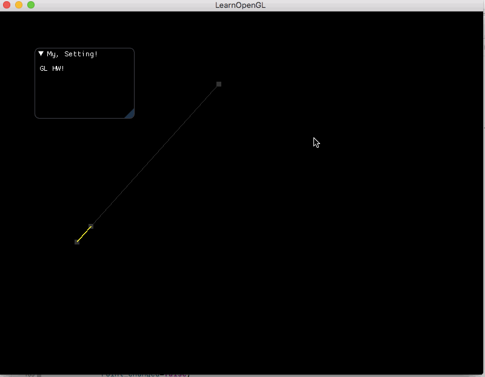
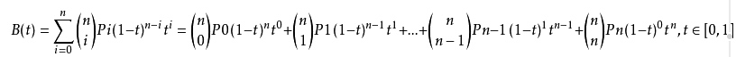

<h3>计算机图形学报告HW8</h3>
<br\>
姓名：朱俊凯 &nbsp;&nbsp;&nbsp;
学号：16340315
<br\>
<h5>要求</h5>
Basic:<br\>
1. 用户能通过左键点击添加Bezier曲线的控制点，右键点击则对当前添加的最后一个控制点进行消除 
2. 工具根据鼠标绘制的控制点实时更新Bezier曲线。

Bonus:<br\>
1. 可以动态地呈现Bezier曲线的生成过程。

<h5>报告</h5>
* 把运行结果截图贴到报告里，并回答作业里提出的问题。

* 报告里简要说明实现思路，以及主要function/algorithm的解释。

    * 鼠标事件：glfwSetCursorPosCallback(window, mouse_callback);设置一个位置变量，回调函数里面讲每次的位置赋值过去，glfwSetMouseButtonCallback(window,onMouseButton);根据左键和右键将当前鼠标位置的点记录或上一个记录点删除。
    * Bezier点位置计算<br\><br\>因此我们$ C_n^r$的方法来确定每一个点前面的系数。另外我们确定一个step步长，来获得[0,1]之间的很多个等差的t值，然后带入，再根据Bezier的控制点，就可以计算生成当中曲线路径上面的点的位置了
    * 绘制点的方式大致与之前绘制三角形、圆的时候差不多，将得到的点绘制出来。

<h5><strong>Bonus部分:</strong></h5>
要求：可以动态地呈现Bezier曲线的生成过程。<br\>
通过glfwtime获得一个[0,1]之间的t值，然后就让每两个相邻的点根据当前的t，以1-t:t生成一个新点，从而获得一个新的点集，在新的点集上重复此操作直至得到一个点，也就是t对应Bezier曲线上的点，之前每一个点集都去生成直线，就达到了对应的效果。
